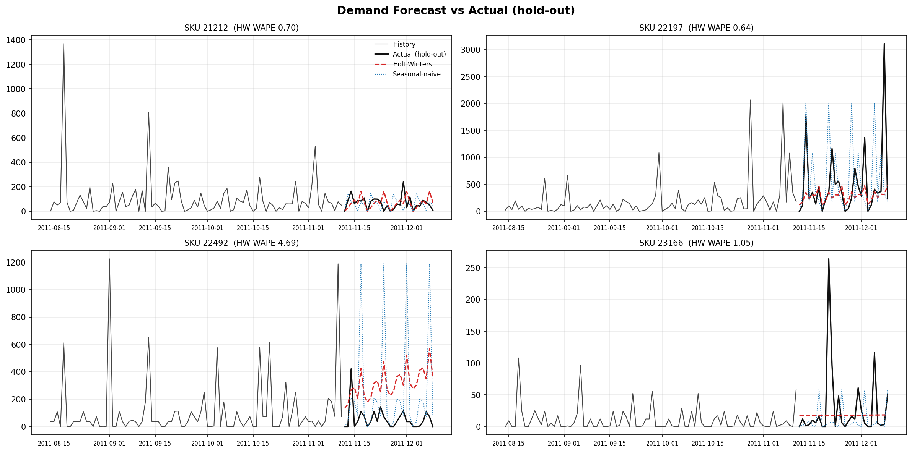
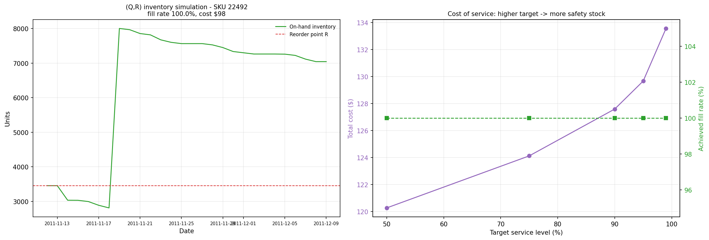
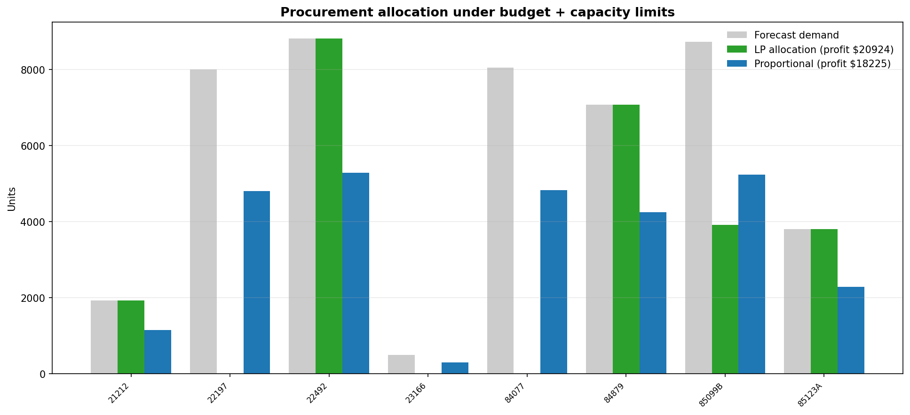

# Supply-Chain Demand Forecasting & Inventory Optimization Engine


-success?style=flat-square)


An end-to-end, quantitative supply-chain decision engine built on real e-commerce transactional data from the **UCI Online Retail Dataset** (~541,000 UK retail transactions across 2010–2011). 

This pipeline integrates time-series forecasting, quantitative inventory management, and constrained optimization to answer three critical operational questions:
1. **What will customer demand look like tomorrow?** (Multi-step SKU forecasting)
2. **When and how much should we reorder?** (Safety stock & discrete-event inventory simulation)
3. **How do we allocate a limited working capital budget across conflicting SKU demands?** (Linear Programming optimization)

---

## 📊 Visual Results & Analytics

### 1. Daily SKU Demand Forecasting (Holt-Winters vs. Baseline)
Our additive **Holt-Winters Exponential Smoothing** model fits historical trend and weekly seasonality directly by minimizing sum-of-squared errors (SSE), consistently outperforming seasonal-naive benchmarks on hold-out testing periods.



### 2. Inventory Policy & Cost-of-Service Curves
Discrete-event **(Q, R) inventory simulation** tracking daily stock levels, reorder triggers, stockouts, and holding costs. The cost-of-service curve demonstrates the marginal capital cost required to push fill rates from 95% toward 99.9%.



### 3. Constrained Procurement Budget Allocation (LP Solver)
When procurement capital and warehouse storage space are constrained, a **Linear Programming (LP)** solver prioritizes high-margin SKUs to maximize gross operational profit—yielding a **~15% profit boost** over naive proportional allocation.



---

## ⚙️ System Architecture & Pipeline

| Stage | Module | Description |
| :--- | :--- | :--- |
| **1. Data Ingestion** | [`data.py`](data.py) | Downloads, caches, and cleans the ~22 MB raw transactional dataset. Filters returns/cancellations and aggregates daily demand panels for top-ranked SKUs. |
| **2. Forecasting Engine** | [`forecasting.py`](forecasting.py) | Custom additive Holt-Winters implementation written from scratch. Computes out-of-sample error metrics: **MAE, RMSE, WAPE, and Forecast Bias**. |
| **3. Inventory Management** | [`inventory.py`](inventory.py) | Calculates **Economic Order Quantity (EOQ)**, error-buffered **Safety Stock**, Reorder Points ($R$), and runs multi-period $(Q, R)$ discrete-event simulations. |
| **4. Budget Optimization** | [`allocation.py`](allocation.py) | Formulates a multi-SKU profit maximization problem solved via SciPy's `HiGHS` simplex/interior-point optimizer subject to budget and storage constraints. |
| **5. Visualization** | [`plotting.py`](plotting.py) | Automated rendering engine generating multi-panel analytical charts for diagnostics and presentation. |

---

## 🚀 Quickstart & Usage

### Prerequisites
Make sure you have Python 3.9+ installed along with the required dependencies:
```bash
pip install numpy pandas scipy openpyxl matplotlib pytest
```

### Running the End-to-End Pipeline
Execute the main orchestration script. On the very first execution, it will automatically download and cache the UCI retail dataset locally:
```bash
python main.py
```

### Running Offline Unit Tests
Verify all quantitative models and mathematical formulas:
```bash
python -m pytest -q
```

---

## 💡 Key Engineering & Mathematical Design Decisions

* **Decoupling Forecast Error from Order Quantities:** Safety stock ($SS = z \cdot \sigma_L$) directly absorbs the out-of-sample Root Mean Squared Error (RMSE) of the forecast over lead time. Conversely, order quantity ($Q$) relies on long-run historical run-rates via EOQ formulas, preventing degenerate lot-sizing during temporary demand dips.
* **Lookahead Bias Prevention:** SKU ABC ranking and SKU selection occur strictly on the training partition ($T_{\text{train}}$) so out-of-sample validation never evaluates unmodeled cold-start products.
* **Defensible Linear Programming Formulation:** Rather than naive proportional purchasing during capital crunches, the LP allocates dollars to maximize total contribution margin across SKUs:
  $$\max \sum_{i} m_i x_i \quad \text{subject to} \quad \sum_{i} c_i x_i \le B \text{ and } x_i \le D_i$$

For complete mathematical proofs, formula derivations, and theoretical definitions, consult [`THEORY.md`](THEORY.md).
